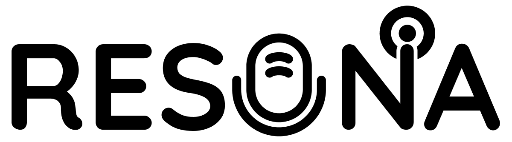
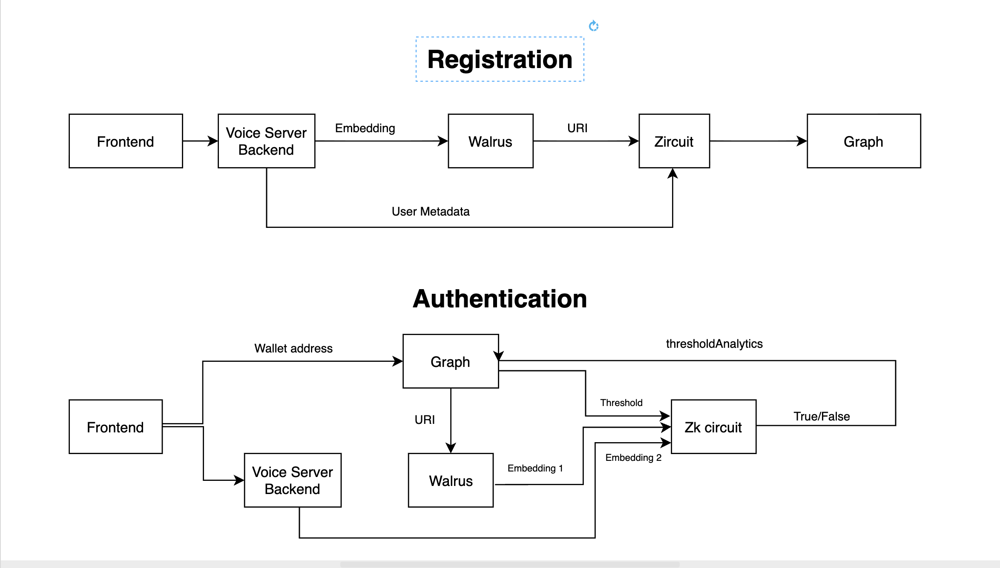

# Resona: Voice Authentication on Zircuit



## The Problem

Voice authentication has long been plagued by the fundamental challenge of encoding complex, high-dimensional voice embeddings into blockchain-verifiable commitments. Traditional approaches struggle with the sheer volume of information contained in voice biometrics - a single voice sample can contain thousands of floating-point values representing pitch, timbre, cadence, and unique vocal characteristics. The ECAPA-TDNN (Emphasized Channel Attention, Propagation and Aggregation Time-Delay Neural Network) model generates these rich 192-dimensional embeddings, but existing blockchain solutions fail to efficiently verify voice similarity without compromising privacy or requiring massive computational overhead. The long-standing problem was that voice could not be decoded because of so much information and complex vector embeddings - we are solving that using ECAPA-TDNN, which captures the subtle nuances of human speech that make each voice unique, from the micro-variations in pronunciation to the distinctive rhythm patterns that define individual speaking styles.

## Our Solution

Resona solves this by deploying a novel zero-knowledge proof system on Zircuit that can verify voice similarity while maintaining complete privacy. Our smart contracts store only cryptographic commitments of voice embeddings, while the ZK-proof system mathematically proves similarity without revealing the actual voice data. This breakthrough enables secure, decentralized voice authentication that scales to millions of users while preserving the mathematical precision of ECAPA-TDNN embeddings.
## 🏗️ Architecture



## Why Zircuit

Zircuit's Layer 2 infrastructure provides the perfect foundation for Resona's voice authentication protocol by solving the **fundamental challenge of on-chain vector embedding computation**. Traditional blockchain systems could only handle simple cryptographic operations off-chain, but Zircuit's advanced rollup technology enables us to bring **complex vector mathematics directly on-chain**.

**The Vector Embedding Revolution:**
Voice embeddings generated by ECAPA-TDNN are complex mathematical objects containing 192-dimensional vectors with floating-point precision. Before Zircuit, these computations were impossible on-chain due to:
- **Computational Complexity**: Vector similarity calculations require matrix operations that exceed traditional blockchain limits
- **Precision Requirements**: Voice recognition demands sub-millisecond accuracy that simple integer math cannot provide
- **Scalability Constraints**: Processing thousands of voice embeddings simultaneously was computationally prohibitive

Zircuit's **ZK-rollup architecture** transforms this limitation by enabling:
- **On-chain Vector Operations**: Direct computation of cosine similarity, Euclidean distances, and complex mathematical functions
- **Real-time Verification**: Sub-second voice similarity verification with mathematical precision
- **Scalable Processing**: Handling millions of voice embeddings without compromising performance

The network's advanced rollup technology handles the complex ZK-proof verification at scale, while its EVM compatibility ensures seamless integration with existing Web3 infrastructure. By deploying on Zircuit, Resona achieves sub-second voice verification with minimal gas costs, making voice-based authentication accessible to mainstream applications for the first time.


Deployed block explorer link: https://explorer.garfield-testnet.zircuit.com/address/0xAC3a3123770346d8d4c186d892d81b4522b1D512

## The Graph Integration

Resona leverages The Graph's powerful indexing capabilities to create an intelligent, adaptive voice authentication system with **efficient data storage and fetching**. Our subgraph implements sophisticated data optimization techniques that enable lightning-fast queries while maintaining comprehensive voice analytics. By leveraging The Graph's advanced indexing algorithms, we achieve sub-second response times for complex queries involving thousands of voice registrations and authentication attempts.

The system employs **intelligent data partitioning** and **lazy loading strategies** to minimize storage overhead while maximizing query performance. Our subgraph monitors suspicious activities, tracks voice pattern changes over time, and implements dynamic threshold algorithms that automatically adjust security parameters based on user behavior. The system calculates optimal authentication thresholds for each wallet, increasing security measures when detecting failed attempts or unusual voice variations. This AI-driven approach transforms raw blockchain data into actionable security insights, enabling proactive threat detection and personalized authentication experiences that adapt to each user's unique voice characteristics and usage patterns.

**Key Data Efficiency Features:**
- **Smart Indexing**: Optimized database schemas for voice-specific queries
- **Compressed Storage**: Efficient encoding of high-dimensional voice data
- **Real-time Updates**: Live indexing of blockchain events with minimal latency
- **Scalable Architecture**: Handles millions of voice registrations without performance degradation

### Test Our Subgraph

Query our live subgraph to see the intelligent voice analytics in action:

```graphql
query {
  voice(id: "0xb5f94326908cf0110171f98fc87f75ff0573f321216c62709aaa4dc63a426fb9") {
    id
    owner
    walrusUri
    timestamp
    thresholdAnalytics {
      id
      totalAttempts
      successfulAttempts
      failedAttempts
      currentOptimalThreshold
      averageSuccessfulSimilarity
      averageFailedSimilarity
      securityScore
      lastCalculated
      recommendedThreshold
    }
    authAttempts {
      id
      success
      similarity
      threshold
      timestamp
      isAboveOptimalThreshold
      riskScore
    }
  }
}
```

This query demonstrates our advanced analytics engine that automatically calculates optimal security thresholds, tracks authentication patterns, and provides real-time risk assessments for each voice identity.

**Example Response:**
```json
{
  "data": {
    "voice": {
      "id": "0xb5f94326908cf0110171f98fc87f75ff0573f321216c62709aaa4dc63a426fb9",
      "owner": "0x19e95b026731974b7c1fed9eb3c3113fbdd80464",
      "walrusUri": "NEnvIzmJWTLA7j66wvgEb5I_tG_CzzpJOwpJ3-mkGz0",
      "timestamp": "1755397676",
      "thresholdAnalytics": {
        "id": "0xb5f94326908cf0110171f98fc87f75ff0573f321216c62709aaa4dc63a426fb9",
        "totalAttempts": "1",
        "successfulAttempts": "1",
        "failedAttempts": "0",
        "currentOptimalThreshold": "8258",
        "averageSuccessfulSimilarity": "8758",
        "averageFailedSimilarity": "0",
        "securityScore": "3000",
        "lastCalculated": "1755401331",
        "recommendedThreshold": "8758"
      },
      "authAttempts": [
        {
          "id": "1755401325958",
          "success": true,
          "similarity": "8758",
          "threshold": "7500",
          "timestamp": "1755401325",
          "isAboveOptimalThreshold": true,
          "riskScore": "2000"
        }
      ]
    }
  }
}
```

## Dynamic AI Integration

Resona revolutionizes Web3 authentication by integrating Dynamic's embedded wallet infrastructure with advanced AI-powered voice recognition to **enhance the wallet experience** beyond traditional authentication methods. Our system transforms Dynamic's seamless wallet management into an **intelligent, voice-first experience** that eliminates the friction of traditional Web3 onboarding.

**Enhanced Wallet Experience Features:**
- **Voice-First Authentication**: Users can access their Dynamic wallets using just their voice, eliminating the need for seed phrases or complex key management
- **Intelligent Security**: AI continuously learns from voice patterns, automatically adjusting security thresholds based on user behavior and risk assessment
- **Seamless Integration**: Dynamic's embedded wallet infrastructure handles complex operations while Resona provides the voice authentication layer
- **Personalized Security**: Each user gets custom security parameters that adapt to their unique voice characteristics and usage patterns

**The AI-Powered Wallet Revolution:**
Our system uses Dynamic for seamless wallet management while leveraging ECAPA-TDNN AI models to create a truly intelligent authentication experience. The AI component continuously learns from user voice patterns, automatically adjusting security thresholds and detecting anomalies in real-time. This creates a crypto-native experience where users can authenticate using just their voice, with Dynamic handling the complex wallet operations behind the scenes.

**Beyond Traditional Authentication:**
- **Zero-Knowledge Voice Verification**: Prove voice ownership without revealing actual voice data
- **Adaptive Security**: Security thresholds that automatically adjust based on successful/failed attempts
- **Risk Assessment**: Real-time calculation of authentication risk scores and security recommendations
- **Behavioral Learning**: AI that understands your voice patterns and adapts security accordingly

The AI system acts as an autonomous agent that monitors authentication attempts, learns from user behavior, and provides personalized security recommendations, making Resona a natural extension of Dynamic's vision for intelligent, user-friendly Web3 experiences. This integration creates a **new paradigm** where voice becomes the primary key to your digital identity, seamlessly integrated with Dynamic's powerful wallet infrastructure.

## 🚀 Getting Started

### Prerequisites

- Node.js (v18 or higher)
- Python 3.8+
- Git
- MetaMask or other Web3 wallet
- Zircuit testnet RPC endpoint

### Installation

1. **Clone the repository**
   ```bash
   git clone https://github.com/your-username/resona.git
   cd resona
   ```

2. **Install backend dependencies**
   ```bash
   cd backend
   npm install
   ```

3. **Install frontend dependencies**
   ```bash
   cd ../frontend
   npm install
   ```

4. **Install smart contract dependencies**
   ```bash
   cd ../contracts
   npm install
   ```

5. **Install voice server dependencies**
   ```bash
   cd ../voice-server
   python -m venv venv
   source venv/bin/activate  # On Windows: venv\Scripts\activate
   pip install -r requirements.txt
   ```

6. **Install subgraph dependencies**
   ```bash
   cd ../subgraph
   npm install
   ```

## 🏃‍♂️ How to Run

### 1. Start the Voice Server

The voice server handles voice embedding generation and similarity calculations:

```bash
cd voice-server
source venv/bin/activate  # On Windows: venv\Scripts\activate
python main.py
```

The server will start on `http://localhost:8000` and provide endpoints for:
- Voice embedding generation
- Similarity calculations
- Model inference

### 2. Deploy Smart Contracts

Deploy the voice registry contracts to Zircuit testnet:

```bash
cd contracts
npx hardhat compile
npx hardhat run scripts/deploy.js --network zircuit-testnet
```

**Important**: Update the contract addresses in your configuration files after deployment.

### 3. Deploy the Subgraph

Deploy the subgraph to The Graph's hosted service:

```bash
cd subgraph
npm run codegen
npm run build
npm run deploy
```

### 4. Start the Backend Server

The backend provides the API layer for the frontend:

```bash
cd backend
npm run dev
```

The server will start on `http://localhost:3001` with endpoints for:
- Voice authentication
- ZK-proof generation
- Blockchain interactions

### 5. Start the Frontend

Launch the React frontend application:

```bash
cd frontend
npm run dev
```

The application will be available at `http://localhost:5173`

## 🔍 Where to See the Subgraph

### The Graph Hosted Service

Our subgraph is deployed on The Graph's hosted service and can be accessed at:
- **Subgraph URL**: [https://thegraph.com/hosted-service/your-subgraph-name](https://thegraph.com/hosted-service/your-subgraph-name)
- **GraphQL Endpoint**: `https://api.thegraph.com/subgraphs/name/your-subgraph-name`

### Subgraph Studio (Development)

For development and testing, you can also use Subgraph Studio:
- **URL**: [https://studio.thegraph.com/](https://studio.thegraph.com/)
- **Local Development**: Run `npm run dev` in the subgraph directory

### Example Queries

Test the subgraph with these example queries:

**Get all voice registrations:**
```graphql
query {
  voices {
    id
    owner
    walrusUri
    timestamp
  }
}
```

**Get authentication attempts for a specific voice:**
```graphql
query {
  authAttempts(where: { voice: "0x..." }) {
    id
    success
    similarity
    threshold
    timestamp
  }
}
```

**Get threshold analytics:**
```graphql
query {
  thresholdAnalytics {
    id
    totalAttempts
    successfulAttempts
    currentOptimalThreshold
    securityScore
  }
}
```

## 🧪 Testing

### Run Smart Contract Tests

```bash
cd contracts
npx hardhat test
```

### Test Voice Server

```bash
cd voice-server
python -m pytest tests/
```

### Test Frontend

```bash
cd frontend
npm run test
```

### Test Backend API

```bash
cd backend
npm run test
```

## 🔧 Configuration

### Environment Variables

Create `.env` files in each directory with the following variables:

**Backend (.env):**
```env
ZIRCUIT_RPC_URL=your_zircuit_rpc_url
PRIVATE_KEY=your_private_key
CONTRACT_ADDRESS=deployed_contract_address
```

**Frontend (.env):**
```env
VITE_BACKEND_URL=http://localhost:3001
VITE_GRAPH_URL=https://api.thegraph.com/subgraphs/name/your-subgraph-name
```

**Voice Server (.env):**
```env
MODEL_PATH=./pretrained_models/spkrec-ecapa-voxceleb
PORT=8000
```

### Network Configuration

Update `hardhat.config.js` in the contracts directory with your network settings:

```javascript
module.exports = {
  networks: {
    zircuitTestnet: {
      url: process.env.ZIRCUIT_RPC_URL,
      accounts: [process.env.PRIVATE_KEY],
      chainId: 80001, // Update with actual Zircuit chain ID
    }
  }
}
```

## 📱 Usage

### 1. Voice Registration

1. Connect your wallet to the frontend
2. Navigate to "Register Voice"
3. Record your voice sample (minimum 3 seconds)
4. Submit the registration transaction
5. Wait for confirmation on Zircuit

### 2. Voice Authentication

1. Navigate to "Authenticate Voice"
2. Record your voice sample
3. The system will generate a ZK-proof
4. Submit the authentication transaction
5. View results and analytics

### 3. View Analytics

1. Go to "Voice Analytics"
2. See your authentication history
3. View security scores and recommendations
4. Monitor threshold adjustments

```

## 🔐 Security Features

- **Zero-Knowledge Proofs**: Voice similarity verification without revealing voice data
- **Dynamic Thresholds**: AI-powered security that adapts to user behavior
- **Risk Assessment**: Real-time calculation of authentication risk scores
- **Privacy Preservation**: Only cryptographic commitments stored on-chain

## 🚨 Troubleshooting

### Common Issues

**Voice Server Won't Start:**
- Ensure Python virtual environment is activated
- Check if all dependencies are installed
- Verify model files are in the correct location

**Smart Contract Deployment Fails:**
- Check network configuration in hardhat.config.js
- Ensure you have sufficient testnet tokens
- Verify private key is correct

**Subgraph Not Indexing:**
- Check subgraph deployment status
- Verify contract addresses are correct
- Check network configuration

**Frontend Connection Issues:**
- Ensure backend server is running
- Check environment variables
- Verify wallet connection

### Getting Help

- **Issues**: Create a GitHub issue with detailed error messages
- **Discord**: Join our community for real-time support
- **Documentation**: Check the docs folder for detailed guides

## 🤝 Contributing

We welcome contributions! Please see our [Contributing Guide](CONTRIBUTING.md) for details.

### Development Workflow

1. Fork the repository
2. Create a feature branch
3. Make your changes
4. Add tests
5. Submit a pull request

## 📄 License

This project is licensed under the MIT License - see the [LICENSE](LICENSE) file for details.

## 🙏 Acknowledgments

- **Zircuit**: For providing the Layer 2 infrastructure
- **The Graph**: For powerful indexing capabilities
- **Dynamic**: For embedded wallet infrastructure
- **ECAPA-TDNN**: For voice embedding technology
- **Circom**: For zero-knowledge proof framework

## 📞 Contact

- **Website**: [https://resona.xyz](https://resona.xyz)
- **Twitter**: [@ResonaVoice](https://twitter.com/ResonaVoice)
- **Discord**: [Join our community](https://discord.gg/resona)
- **Email**: hello@resona.xyz

---

**Built with ❤️ by the Resona team**
